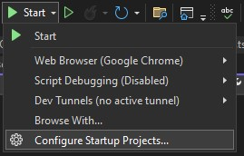
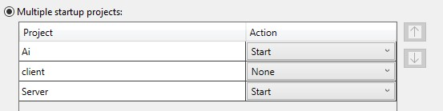
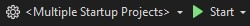

# FullStack Labor

## Bevezetés

A labor során önállóan fogsz elkészíteni egy LLM-et használó fullstack alkalmazást. A labor célja, hogy tapasztalatot szerezz a fullstack környezetben történő fejlesztésről, illetve gyakorold a prompt írást.

A feladatok megoldásához az alábbi telepített szoftverekre van szükség (alternatívaként használhatjuk a [BME Cloud](https://cloud.bme.hu/) egyik virtuális gépét):

- [Visual Studio](https://visualstudio.microsoft.com/vs/community/)
    - `ASP.NET and web development ` workload
    - `.NET 8.0 Runtime` és `.NET SDK`
- [Node.js](https://nodejs.org/en/download/prebuilt-installer)
- [Git](https://git-scm.com/)

## Előkészület

A feladatok megoldása során ne felejtsd el követni a feladatbeadás folyamatát, amiről [itt olvashatsz részletesen](../../tudnivalok/github/GitHub.md).

### Git repository létrehozása és letöltése

1. Moodle-ben keresd meg a laborhoz tartozó meghívó URL-jét és annak segítségével hozd létre a saját repository-dat.
2. Várd meg, míg elkészül a repository, majd checkout-old ki.
3. Hozz létre egy új ágat `megoldas` néven, és ezen az ágon dolgozz.
4. A neptun.txt fájlba írd bele a Neptun kódodat. A fájlban semmi más ne szerepeljen, csak egyetlen sorban a Neptun kód 6 karaktere.

### Lokális LLM modell inicializálása

A feladat elkészítése során egy lokális LLM modellt fogunk használni. Ennek a módszernek az előnye, hogy nincs szükséged regisztrációra, nem kell előfizetni semmilyen modellre, és nincsenek korlátok abban, hogy hányszor tesztelsz. Ugyanakkor hátránya, hogy mivel a modellt a saját gépeden kell futtatni, ezért a számítógéped erőforrásai befolyásolják a futás gyorsaságát. A lentebb felsoroltak közül bármelyik modellt használhatod, ezek mindegyike eltérő rendszerkövetelményekkel rendelkeznek. A kisebb modellek esetében kisebb a gépigény, viszont pontatlanabb válaszokat is adhat, míg a nagyobb modellek pontosabbak, de akár több perces válaszidőre is számíthatsz.

A feladat megoldásához egy `LLama` modellt fogunk használni, amihez a modell fájlt `GGUF` formátumban kell beszereznünk. Modelleket a [https://huggingface.co/](https://huggingface.co/) oldalon tudsz böngészni. A feladat megoldásához az alábbi modelleket javasoljuk:

- Kis modell: [https://huggingface.co/bartowski/Llama-3.2-1B-Instruct-GGUF](https://huggingface.co/bartowski/Llama-3.2-1B-Instruct-GGUF)
- Közepes modell: [https://huggingface.co/bartowski/Llama-3.2-3B-Instruct-GGUF](https://huggingface.co/bartowski/Llama-3.2-3B-Instruct-GGUF)
- Nagy modell: [https://huggingface.co/bartowski/Meta-Llama-3.1-8B-Instruct-GGUF](https://huggingface.co/bartowski/Meta-Llama-3.1-8B-Instruct-GGUF)

A felsoroltak közül a közepes modellel tökéletes eredményeket lehet elérni.

Minden modell esetében a leírásban találunk egy összehasonlítást a modellek egyes altípusairól. Ez a táblázat tartalmazza a modellek méreteit is. Javasoljuk a `Q5_K_M` verziók használatát. Miután kiválasztottuk a számunkra megfelelő modellt, töltsük le a hozzá tartozó `GGUF` kiterjesztésű fájlt, majd másoljuk ezt a projekt `AI/Resources` mappájába `llama.gguf` néven.

### Projektek elindítása

A solution 3 projektből áll:
    
- **AI**: Az LLM modell beburkolására szolgáló WebAPI, ami a [http://localhost:5555/](http://localhost:5555/) címen érhető el. Az API leírását a [/swagger/index.html](http://localhost:5555/swagger/index.html) címen tudjuk kiolvasni. Ebben a projektben nem kell mósosításokat végezni a feladat megoldása során, minden elő van készítve. A célja, hogy ezen keresztül el tudjuk érni a lokálisan futtatott modellt.
- **Server**: A FullStack alkalmazáshoz tartozó backend. A [http://localhost:5130/](http://localhost:5130/) címen érhető el. Az API leírását a [/swagger/index.html](http://localhost:5130/swagger/index.html) címen tudjuk kiolvasni.
- **Client**: A FullStack alkalmazáshoz tartozó React frontend. A [http://localhost:5173/](http://localhost:5173/) címen érhető el.

A futtatáshoz az `AI` és a `Server` projekteket kell elindítani:

- Menjünk a `Configure Startup Projects...` opcióra.

    

- Jelöljük be a `Multiple statup projects:` jelölőt, és válasszuk ki a `Start` opciót az `AI` és a `Server` projekteknél.

    

- Menjünk az `OK` gombra, majd `Start`.

    

## Az elkészítendő alkalmazás

A labor során egy olyan LLM-et használó fullstack alkalmazást kell önállóan elkészítened, mely a munkaerőtoborzással kapcsolatos egyes feladatokat könnyíti meg. Az alkalmazásban nincs szükség authentikációra, adatbázisra, vagy perzisztenciára. Az alkalmazás állapot mentes. Az elkészülő HR asszisztens alkalmazás célja, hogy támogassa a HR munkatársakat a beérkező jelentkezések feldolgozásában. A markdown formátumban megküldött önéletrajzok alapján, a szoftvernek képesnek kell lennie a következő feladatok megoldására:

- A jelentkező kulcs kompetenciáinak kigyűjtése
- Azoknak a pozícióknak a meghatározása, melyekre a jelentkező alkalmas lehet
- A jelentkező legfontosabb adatainak táblázatba rendezése
- Lehetséges interjú kérdések generálása
- Automatikus levél generálása interjúra törénő behíváshoz

## 0. feladat

Az alkalmazás funkcióinak teszteléséhez elengedhetetlen egy markdown önéletrajz. Az első feladat során ezt kell létrehoznod, hogy a későbbiekben fel tudd majd használni. Az önéletrajz mindenképp tartalmazza a jelentkező nevét és egyéb fontos adatait, a tanulmányainak és korábbi munkatapasztalatainak bemutatását, valamint főbb készségeit. Az adatok tetszőlegesen megadhatók, formailag azonban mindenképp kövesse az önéletrajzok főbb szempontjait. Az önéletrajz létrehozására használható a kiinduló kliens *Editor* felülete.

??? info "Tipp"
    A `Client/src/App.tsx` fájlban megadható default önéletrajz, amivel a tesztelés tovább egyszerűsíthető/gyorsítható.

### Beadandó

!!! example "0. feladat beadandó (0 pont)"
    Készíts képernyőképet az elkészült önéletrajzról, majd **`f0.png`** néven másold a repository gyökerébe!

## 1. feladat #

Első lépésben biztosítsd a szerver számára az AI modellel való kommunikáció alapjait az alábbiak szerint.

1. Futtasd a kiinduló alkalmazást és vizsgáld meg az AI modell API leírását (`/api/Chat`) a fent megadott címen. Keresd meg a leírásban a kérés és a válasz törzsének  felépítését. A HTTP kérés kiszolgálása során, a szerver és az AI modellt burkoló WebAPI közötti kommunikáció ezeket a JSON formátumokat használja.
2. Hozd létre a fentieknek megfelelően a kommunikációhoz szükséges modell osztály(oka)t, mely(ek) példányait sorosítva az előző lépésben vizsgált JSON objektumokat kapjuk.
3. Hozz létre egy service interface-t, az ezt megvalósító service osztályt. A service valósítsa meg a megfelelő HTTP kérést, mely segítségével tetszőleges prompt küldhető az AI modell felé. Rendelkezzen tehát a service egy olyan függvénnyel, ami paraméterként egy (az API leírásnak megfelelő) promptot vár, és ezt elküldi az AI projektben definiált végpontra.
4. A feladat végén az elkészült service-t regisztrálni is kell a DI (Dependency Injection) konténerbe.

    ??? info "Tipp"
        A DI konténerbe service-t regisztrálni a `Main` függvényen belül, az `AddScoped` függvény meghívásával lehet.

??? info "Segítség"
    Az `/api/Chat/Stream` végponttal egyelőre nem kell foglalkoznod, az csak az opcionális feladathoz tartozik.

### Beadandó

!!! example "1. feladat beadandó (10 pont)"
    Kommitold a változtatásokat, különös tekintettel az alábbiakra:

    * Service interface és az azt implementáló service osztály megvalósítása
    * Modell osztály(ok)

## 2. feladat

Ebben a feladatban a kliens és a szerver közötti kommunikációt kell biztosítanod. Egészítsd ki az előkészített controller osztályt úgy, hogy az az előző feladatban létrehozott service-t használja. Az egyes végpontoknak a HR asszisztens alkalmazás által biztosított egyes funkciókat kell megvalósítania. Az AI modell felé küldött promptok megfogalmazása a controller osztályban történjen.

Az alábbi felsorolás tartalmazza, hogy a szerver mely API végpontjai milyen funkciókat kell, hogy megvalósítsanak:

- `/api/HR/competences`: A kérésben kapott CV alapján listázza a jelentkező kulcs kompetenciáit. A válasz egy 3-5 pontból álló felsorolás legyen markdown formátumban. 
- `/api/HR/positions`: A kérésben kapott CV alapján határozza meg, hogy a jelentkező milyen pozíciók betöltésére lehet alkalmas. 
- `/api/HR/data`: A kérésben kapott CV alapján gyűjtse táblázatba a jelentkező legfontosabb adatait. A válasz egy markdown formátumban meghatározott kitöltött táblázat legyen.
- `/api/HR/questions`: A kérésben kapott CV alapján fogalmazzon meg lehetséges kérdéseket, amiket érdemes lehet feltenni az állásinterjú során.
- `/api/HR/invitation`: Generáljon meghívólevelet a kérésben kapott CV "tulajdonosa" részére, ami alkalmas egy interjúra történő behívásra.

A megoldás főbb lépései a következők:

1. Az egyes végpontok által meghívott service osztályt Dependency Injection (DI) használatával kérd el az alkalmazástól, hogy a controller használni tudja.
2. Valósíts meg minden végponthoz egy-egy függvényt, amely a fenti leírásnak megfelelő funkciót biztosítja, a következők szerint:
    - A függvény paraméterként kapja meg a CV-t valamilyen formában.
    - A funkciónak megfelelően hozza létre a promptot.
    - A service felhasználásával küldje el a promptot az AI modellnek.

    ??? info "Tipp"
        A prom létrehozása során tartsd szem előtt a felesleges kódduplikáció elkerülését. A modell használta során az AI projekt felé küldött HTTP kérések azonos felépítésű, de különböző tartalmú promptokat fognak tartalmazni.

    

### Beadandó

!!! example "2. feladat beadandó (15 pont)"
    Kommitold a változtatásokat, különös tekintettel az alábbiakra:
    
    * A Controller osztály kódja
    * A megvalósított promptok

    Képernyőképekkel alátámasztva demonstráld a Controller osztály helyes működését:
    
    * Server API egyes végpontjait meghívva kapott eredmények (swagger segítségével kipróbálva).
    * Minden végponthoz készíts külön képernyőképet.

    A készített képernyőképeket másold **`f2-1.png`** – **`f2-5.png`** néven a repository gyökerébe!

## 3. feladat

Az alkalmazás megvalósításának utolsó lépéseként tedd működővé az egyes funkciókat az előző feladatban létrehozott API hívások segítségével. Ehhez egészítsd ki a kliens Service osztályát a megfelelő HTTP kérésekkel.

- Minden funkcióhoz/API végponthoz tartozzon egy függvény, amely paraméterként megkapja a CV-t, és megvalósítja a HTTP kérést.
- Figyelj a felesleges kódismétlés elkerülésére!
- A HTTP kérés megvalósítása során gondoskodj a megfelelő hibakezelésről is.

### Beadandó

!!! example "3. feladat beadandó (10 pont)"
    Kommitold a változtatásokat, különös tekintettel az alábbiakra:

    * Kliens Service osztálya

    Képernyőképekkel alátámasztva demonstráld a kliens Service osztályának helyes működését:

    * Kliens *Overview* oldala az eredményekkel
    * Kliens *Interview* oldala az eredményekkel

    A készített képernyőképeket másold **`f3-1.png`** és **`f3-2.png`** néven a repository gyökerébe!

## Opcionális feladat

Opcionális feladatként alakítsd át/egészítsd ki úgy az alkalmazást, hogy az AI modell válaszát JSON helyett stream formájában kapod meg. Ennek eredményeként a kliens felületén az egyes funkciók válaszként kapott szövege nem egyszerre, hanem folyamatosan "gépelve" kell, hogy megjelenjen. (Hasonlóképp, mint pl. a ChatGPT esetén.) Segítségként, az AI projektben már minden adott, ott nem kell módosítani semmit.

!!! warning "Fontos"
    Mielőtt ennek a feladatnak neki kezdesz, mindenképp commitolj! Így ha módosítasz, vagy törölsz valamit, akkor is lesz nyoma, hogy korábban hogyan csináltad.

??? info "Tipp"
    Feladatok checklist:

    - JSON API (`/api/Chat`) lecserélése Stream API-ra (`/api/Chat/Stream`).
    - Service és Controller megfelelő módosítása.
    - Kliens Service megfelelő módosítása.
    - Az oldalakon a megfelelő metódus meghívása (tipp: a `Module` komponensnek van egy `streamGetter` attribútuma is)

### Beadandó

!!! example "Opcionális feladat beadandó (10 pont)"
    Kommitold a változtatásokat, különös tekintettel az alábbiakra:

    * Server Service
    * Server Controller
    * Kliens Service
    * Kliens Oldalak

    Egy-egy képernyőképpel alátámasztva demonstráld az alábbiak megoldását:

    * Készíts egy-egy képernyőképet a kliens oldalról, ahol az egyik válasznak még csak egy része érkezett meg, illetve amikor már az egész megérkezett.

    A készített képernyőképeket másold **`fo-1.png`** és **`fo-2.png`** néven a repository gyökerébe!