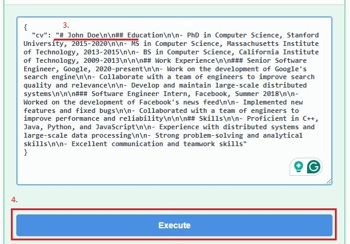

# FullStack Labor

## Bevezetés

A labor során önállóan fogsz elkészíteni egy LLM-et használó fullstack alkalmazást. A labor célja, hogy tapasztalatot szerezz a fullstack környezetben történő fejlesztésről, illetve gyakorold a prompt írást.

A feladatok megoldásához az alábbi telepített szoftverekre van szükség (alternatívaként használhatjuk a [BME Cloud](https://cloud.bme.hu/) egyik virtuális gépét):

- [Visual Studio](https://visualstudio.microsoft.com/vs/community/)
    - `ASP.NET and web development ` workload
    - `.NET 8.0 Runtime` és `.NET SDK`
- [Node.js](https://nodejs.org/en/download/prebuilt-installer)
- [Git](https://git-scm.com/)

## Előkészület

A feladatok megoldása során ne felejtsd el követni a feladatbeadás folyamatát, amiről [itt olvashatsz részletesen](../../tudnivalok/github/GitHub.md).

### Git repository létrehozása és letöltése

1. Moodle-ben keresd meg a laborhoz tartozó meghívó URL-jét és annak segítségével hozd létre a saját repository-dat.
2. Várd meg, míg elkészül a repository, majd checkout-old ki.
3. Hozz létre egy új ágat `megoldas` néven, és ezen az ágon dolgozz.
4. A neptun.txt fájlba írd bele a Neptun kódodat. A fájlban semmi más ne szerepeljen, csak egyetlen sorban a Neptun kód 6 karaktere.

### API kulcs beszerzése

A feladat elkészítése során a [Mistral AI](https://mistral.ai/)-t fogjuk használni. Ennek a szolgáltatásnak van ingyenes verziója, amivel kapunk hozzáférést az API-hoz is, így tökéletesen használható, hogy tapasztalatot szerezzünk ezen a téren.

* Regisztráljunk a [https://v2.auth.mistral.ai/login](https://v2.auth.mistral.ai/login) oldalon.
* Hozzunk létre egy szervezetet az oldalon tetszőleges névvel. Ez a szervezet alá fogjuk majd bepakolni a saját projektjeinket.
* Válasszunk ki egy csomagot, ehhez menjünk a [Subscription](https://admin.mistral.ai/plateforme/subscription) oldalra, menjünk a **Compare plans** gombra és válasszuk az **Experiment** csomagot. A választás megerősítéséhez meg kell adnunk a telefonszámunkat, amire egy megerősítő kód fog érkezni.

!!! warning "Limitáció"
    Az **Experiment** csomag ingyenes hozzáférést ad a Mistral AI API-jához, viszont számolnunk kell limitekkel. A legtöbb modell esetében ez 500 ezer token percenként és 1 milliárd token havonta, továbbá másodpercenként csak 1 kérést engedélyez. Ez bőven elegendő lesz a labor megoldásához, nem valószínű hogy meg tudjuk közelíteni ezt a limitet, ugyanakkor célszerű szem előtt tartani és nem túl bőkezűen bánni vele. További fontos dolog, hogy a csomag használatával hozzájárulunk ahhoz, hogy a promptjainkat felhasználják tanítási céllal, így érdemes kerülni a személyes vagy nem publikus információk megadását.

A csomag létrehozás után nincs más teendőnk, mint létrehozni az API kulcsot, ami hozzáférést biztosít majd az API-hoz.

* Menjünk az [API Keys](https://admin.mistral.ai/organization/api-keys) menüpontra és nyomjunk rá a **Create new key** gombra a jobb felső sarokban.
* Adjunk meg egy nevet a kulcsnak (pl. `FullStackLabor`) és válasszunk egy tetszőleges lejárati dátumot.
* Másoljuk ki az API kulcsot és mentsük el egy biztonságos helyre, mivel később nem lesz alkalmunk rá, hogy újra megnézzük.

### Projektek elindítása

A solution 2 projektből áll:
    
- **Server**: A FullStack alkalmazáshoz tartozó backend. A [http://localhost:5130/](http://localhost:5130/) címen érhető el. Az API leírását a [/swagger/index.html](http://localhost:5130/swagger/index.html) címen tudjuk kiolvasni.
- **Client**: A FullStack alkalmazáshoz tartozó React frontend. A [http://localhost:5173/](http://localhost:5173/) címen érhető el.

A `Server` projekt már tartalmaz egy `launchSettings.json` fájlt ami a futtatáshoz szükséges paramétereket tartalmazza. Az elindításhoz ezért a `Server` projektet kell kiválasztanod, ami automatikusan el fogja indítani a `Client` projektet is:


Ha a start gomb mellett véletlenül nem a `http` feliratot látnád, akkor mellette a legördülő menüből válasszd ki azt.


## Az elkészítendő alkalmazás

A labor során egy olyan LLM-et használó fullstack alkalmazást kell önállóan elkészítened, mely a munkaerőtoborzással kapcsolatos egyes feladatokat könnyíti meg. Az alkalmazásban nincs szükség authentikációra, adatbázisra, vagy perzisztenciára. Az alkalmazás állapot mentes. Az elkészülő HR asszisztens alkalmazás célja, hogy támogassa a HR munkatársakat a beérkező jelentkezések feldolgozásában. A markdown formátumban megküldött önéletrajzok alapján, a szoftvernek képesnek kell lennie a következő feladatok megoldására:

- A jelentkező kulcs kompetenciáinak kigyűjtése,
- Azoknak a pozícióknak a meghatározása, melyekre a jelentkező alkalmas lehet,
- A jelentkező legfontosabb adatainak táblázatba rendezése,
- Lehetséges interjú kérdések generálása,
- Automatikus levél generálása interjúra törénő behíváshoz.

## 0. feladat

Az alkalmazás funkcióinak teszteléséhez elengedhetetlen egy markdown önéletrajz. Az első feladat során ezt kell létrehoznod, hogy a későbbiekben fel tudd majd használni. Az önéletrajz mindenképp tartalmazza a jelentkező nevét és egyéb fontos adatait, a tanulmányainak és korábbi munkatapasztalatainak bemutatását, valamint főbb készségeit. Az adatok tetszőlegesen megadhatók, formailag azonban mindenképp kövesse az önéletrajzok főbb szempontjait. A markdown formátumról [ezen a linken](https://www.markdownguide.org/basic-syntax/) tudsz részletesebben olvasni, valamint rendelkezésedre áll a kiinduló kliens *Editor* felülete is, ahol meg tudsz szerkeszteni egy ilyen önéletrajzot.

!!! warning "Figyelem"
    Habár adódik a lehetőség, hogy elkészítsd a saját önéletrajzodat itt, ez mégsem ajánlott. A Mistral AI gyűjti a promptjainkat és felhasználja későbbi tanításokra, így kerüljük a személyes adatok megadását! Lehetőleg egy fiktív személy önéletrajzát add meg itt.

Itt láthatsz egy példa önéletrajzot, hogy egyszerűbb legyen elképzelni, milyen jellegűt kell neked is készíteni:

```markdown
# John Doe

## Education

- PhD in Computer Science, Stanford University, 2015-2020
- MS in Computer Science, Massachusetts Institute of Technology, 2013-2015
- BS in Computer Science, California Institute of Technology, 2009-2013

## Work Experience

### Senior Software Engineer, Google, 2020-present

- Work on the development of Google's search engine
- Collaborate with a team of engineers to improve search quality and relevance
- Develop and maintain large-scale distributed systems

### Software Engineer Intern, Facebook, Summer 2018

- Worked on the development of Facebook's news feed
- Implemented new features and fixed bugs
- Collaborated with a team of engineers to improve performance and reliability

## Skills

- Proficient in C++, Java, Python, and JavaScript
- Experience with distributed systems and large-scale data processing
- Strong problem-solving and analytical skills
- Excellent communication and teamwork skills
```

!!! info "Tipp"
    A `Client/src/App.tsx` fájlban megadható egy alapértelmezett önéletrajz, amivel egyszerűsíthetű a tesztelés, mivel nem kell kitöltened a mezőt minden egyes indításkor. Ebben az esetben ne felejtsd el a sortöréseket `\n\n`-ekre cserélni a stringben.

### Beadandó

!!! example "0. feladat beadandó"
    Készíts képernyőképet az elkészült önéletrajzról a kliens *Editor* felületén, majd **`f0.png`** néven másold a repository gyökerébe! Abban az esetben, ha az önéletrajzot bemásoltad az `App.tsx` fájlba, akkor kommitold is a változtatásokat.

## 1. feladat

Első feladatban biztosítsd a szerver számára az AI modellel való kommunikáció alapjait.

Tanulmányozd a Mistral AI [API dokumentációját](https://docs.mistral.ai/api/#tag/chat/operation/chat_completion_v1_chat_completions_post). Itt láthatod, hogy a szerver milyen formátumú kérést vár, és az egyes kérésekre milyen formátumú választ fog adni. Fontos, hogy ezt a formátumot kötelező betartani, mivel ha a szerver nem így kapja a kérést, akkor nem fog tudni válaszolni.

### Model osztályok létrehozása

Első lépésként hozzuk létre a kérés és a válasz leírásához szükséges modell osztályokat, melyek példányait sorosítva az előző lépésben vizsgáljt JSON objektumokat kapjuk.

1. Hozz létre egy `ModelRequest.cs` osztályt a **Server** projekt **Models** mappájában (Jobb klikk a mappán, majd *Add* > *Class* ).
2. Másold ki a JSON-t a dokumentációból, töröld ki az alapértelmezetten létrejövő osztályt a fájlban (a *namespace*-t ne!), majd **Edit** > **Paste Special** > **Paste JSON as Classes**. 
3. Ez utóbbi eszköz automatikusan beszúrja a szükséges osztályokat, ugyanakkor érdemes kissé módosítani őket, hogy csak a számunkra lényeges attribútumokat tartalmazzák.
    1. Nevezzük át a `Rootobject` osztályt `ModelRequest`-re.
    2. Töröljük ki a számunkra nem szükséges, opcionális propertyket és osztályokat. Csak a `model`, `max_tokens`, `messages` propertyk maradjanak, továbbá a `Message` osztályon kívül szintén minden törölhető.
    3. Nevezzük át a propertyket `snake_case`-ről `PascalCase`-re, hogy kövessük a C# elnevezési konvencióit.
    4. Cseréljük le a tömbö(ke)t `IEnumerable` típusra.
    5. Állíts be alapértelmezett értéket a propertyknek, a `Model` legyen `mistral-small-latest`, a `MaxTokens` pedig `250`. Ezzel biztosítjuk azt, hogy ezeket a propertyket nem kell kitölteni minden egyes alkalommal. Bátran kísérletezz különböző modellekkel és token mennyiséggel. A tokenek számától függ, hogy milyen hosszú választ fogsz kapni. Ebbe a számba beletartozik az elküldött tokenek száma is, így hosszabb önéletrajz esetén, több tokenre lesz szükséged.
    6. Az alábbi modelleket fogod kapni:
  
    ```csharp
    namespace Server.Models
    {
        public class ModelRequest
        {
            public string Model { get; set; } = "mistral-small-latest";
            public int MaxTokens { get; set; } = 250;
            public IEnumerable<Message> Messages { get; set; }
        }

        public class Message
        {
            public string Role { get; set; }
            public string Content { get; set; }
        }
    }
    ```

4. Egészítsd ki a `ModelRequest` osztályt egy statikus `Generate` metódussal, ami paraméterként vár egy `string` típusú `task` és `cv` változókat, és ez alapján létrehozza a megfelelő osztály(oka)t.
    1. A `task` változó fogja tartalmazni szövegesen azt az utasítást, amit a modellnek szánunk, a `cv` pedig értelemszerűen az önéletrajzot. Ebben az esetben a feladat egy *System prompt* az önéletrajz egy *User prompt* lesz.
    2. A prompt típusát a `Message` osztály `Role` property-je fogja meghatározni.

    ```csharp
    public static ModelRequest Generate(string task, string cv)
    {
        var prompt = new ModelRequest()
        {
            Messages = new[]
            {
                new Message() {Role = "system", Content = task},
                new Message() {Role = "user", Content = cv}
            }
        };
        return prompt;
    }
    ```

    !!! info "Prompt típusok, szerepkörök"
        A  szerepkörök a LLM-ek kommunikációjának alapvető elemei, amelyek segítenek a beszélgetés kontextusának és résztvevőinek elkülönítésében:
    
        * A **System** adja meg az alap kontextust és szabályokat, ezt a modell minden esetben figyelembe veszi,
        * A **User** képviseli a felhasználó kérését,
        * Az **Assistant** a modell saját válaszát tartalmazza.
      
        Ezek együtt biztosítják a konzisztens, irányított és érthető kommunikációt a rendszer és a felhasználó között.

5. Hozd létre a `ModelResponse.cs` osztályt is a korábbiakhoz hasonlóan a modell válaszának leírásához. Ebben az esetben is törölhetjük a felesleges propertyket, számunkra csak a `choices` és az azon belüli `message` lesz releváns. A `message` property-hez újra tudjuk hasznosítani a korábbi `Message` osztályt.

```csharp
namespace Server.Models
{
    public class ModelResponse
    {
        public IEnumerable<Choice> Choices { get; set; }
    }

    public class Choice
    {
        public Message Message { get; set; }
    }
}
```

### Szolgáltatás létrehozása

Hozz létre egy service interface-t, az ezt megvalósító service osztályt. A service valósítsa meg a megfelelő HTTP kérést, mely segítségével tetszőleges prompt küldhető az AI modell felé.

1. Hozz létre egy új mappát a `Server` projektben `Services` néven.
2. A `Services` mappához adj hozzá egy új `IHRService` interface-t (Jobb klikk a mappán, majd *Add* > *New Item* > *Interface*).
3. Az interface-nek legyen egy `Post` metódusa ami egy `ModelRequest` objektumot vár, és visszatérésként egy `ModelResponse` objektumot fog adni. A metódus aszinkron lesz, emiatt a visszatérési értéket be kell csomagolni egy `Task` objektumba.

    ```csharp
    using Server.Models;

    namespace Server.Services
    {
        public interface IHRService
        {
            public Task<ModelResponse> Post(ModelRequest request);
        }
    }
    ```

4. Hozd létre az `IHRService` interface-t implementáló `HRService` osztályt a `Services` mappán belül.
    1. Az osztálynak lesz 3 privát, csak olvasható tagváltozója:         
        1. `string` típusú `_apiKey`, ami az API kulcsot,
        2. `Uri` típusú `_baseUri`, ami az API elérési útját,
        3. és egy `JsonSerializerOptions` típusú `_options`, ami a sorosítóhoz szükséges beállításokat tartalmazza.  

        ```csharp
        using System.Text;
        using System.Text.Json;

        namespace Server.Services
        {
            public class HRService : IHRService
            {
                private readonly string _apiKey;
                private readonly Uri _baseUri;
                private readonly JsonSerializerOptions _options;
            }
        }
        ```
 
    2. A konstruktor várni fog egy `IConfiguration` típusú `configuration` objektumot, ami ezeket a beállításokat fogja tartalmazni.
        1. A beállításoknak értéket az `appsettings.json` fájlban tudunk adni. Az `<api-key>` helyére másoljuk be a korában létrehozott API kulcsot.
       
            ```json
            {
               "Logging": {...},
               "AllowedHosts": "*",
               "Services": {
                   "Mistral": {
                       "Url": "https://api.mistral.ai",
                       "APIKey": "<api-key>"
                   }
               }
            }
            ```  
 
        2. A beállítások értékeit a `configuration["Services:Mistral:Url"]` és `configuration["Services:Mistral:APIKey"]` sorokkal tudjuk kiolvasni. Null érték esetén az értékük  legyen üres string.
        3. Az `_options` egy olyan `JsonSerializerOptions` objektum legyen, ahol a `PropertyNamingPolicy` az `SnakeCaseLower`. Ez fogja biztosítani azt, hogy a modell  *PascalCase* formátumú property-eit a JSON-ben *snake_case* formátumúra alakítja.
       
        ```csharp
        public HRService(IConfiguration configuration)
        {
            _baseUri = new Uri(configuration["Services:Mistral:Url"] ?? "");
            _apiKey = configuration["Services:Mistral:APIKey"] ?? "";
            _options = new JsonSerializerOptions { PropertyNamingPolicy = JsonNamingPolicy.SnakeCaseLower };
        }
        ```
 
    3. Implementáld az interface `Post` metódusát.
        1. A kérést egy `HttpClient` típusú `client` objektum segítségével tudjuk elküldeni. Ezt az objektumot egy `using` blokkon belül szokás használni.
        2. A kliensnek be kell állítani az authentikációhoz az `Authorization` fejlécet `Bearer <api-key>` formátumban, továbbá az `Accept` fejlécet `application/json` értékre,  hogy a szerver tudja, válaszként JSON-t várunk.
        3. A kérés objektumot sorosítani kell, ehhez használjuk a korábban létrehozott `_options` változót, továbbá a kapott szöveget be kell csomagolni egy `StringContent`  objektumba.
        4. A kérést a kliens `PostAsync` metódusával tudjuk elküldeni a dokumentációban szereplő `/v1/chat/completions` útvonalra.
        5. Sikeres teljesítés után, szövegesen kiolvassuk a válasz tartalmát és a kapott JSON-t objektummá alakítjuk.
 
        ```csharp
        public async Task<ModelResponse> Post(ModelRequest request)
        {
            using (var client = new HttpClient())
            {
                client.DefaultRequestHeaders.Authorization = new AuthenticationHeaderValue("Bearer", _apiKey);
                client.DefaultRequestHeaders.Accept.Add(new MediaTypeWithQualityHeaderValue("application/json"));
 
                var promptJson = JsonSerializer.Serialize(request, _options);
                using var content = new StringContent(promptJson, Encoding.UTF8, "application/json");
 
                using var response = await client.PostAsync(new Uri(_baseUri, "/v1/chat/completions"), content);
 
                response.EnsureSuccessStatusCode();
                var responseContent = await response.Content.ReadAsStringAsync();
                var result = JsonSerializer.Deserialize<ModelResponse>(responseContent, _options);
 
                return result;
            }
        }
        ```     

    4. A feladat végén az elkészült service-t regisztráld a DI (Dependency Injection) konténerbe. Ezáltal később el fogjuk tudni érni az alkalmazás más részein. Szolgáltatásokat regisztrálni a `Program.cs` fájlban tudunk.
 
    ```csharp
    namespace Server
    {
        public class Program
        {
            public static void Main(string[] args)
            {
                // ...

                // TODO: Add services to the container.
                builder.Services.AddScoped<IHRService, HRService>();

                // ...
            }
        }
    }
    ```

### Beadandó

!!! example "1. feladat beadandó"
    Kommitold a változtatásokat, különös tekintettel az alábbiakra:

    * Service interface és az azt implementáló service osztály megvalósítása
    * Modell osztály(ok)

## 2. feladat

Ebben a feladatban a kliens és a szerver közötti kommunikáció szerver oldali részét kell biztosítanod. Egészítsd ki az előkészített controller osztályt úgy, hogy az az előző feladatban létrehozott service-t használja. Az egyes végpontoknak a HR asszisztens alkalmazás által biztosított egyes funkciókat kell megvalósítania. 

### A szolgáltatás integrálása controllerbe

A controller osztály `HRController` néven már elő van készítve A `Controllers` mappában. Ez tartalmazza minden egyes végponthoz a megfelelő metódust. A metódusok mindegyike úgy van kialakítva, hogy kap egy `HRRequest` objektumot amiben a frontendről származó önéletrajz utazik a `Cv` property-ben. A metódusoknak válaszként egy `HRResponse` objektumot kell visszaadni, melybe a választ a `Text` propertybe csomagoljuk. Minden egyes metódusban ugyanazt kell végrehajtanunk, csak a paraméterezés (vagyis a feladat leírása a promptban) változik.

1. A korábbi feladatban elkészült és regisztrált szolgáltatás használatához, a controllerben is jelezni kell, hogy használni szeretnénk.
    1. Ehhez vedd fel a controller konstruktorának paraméterei közé az interfacet.
    2. Ezután hozz létre egy privát, csak olvasható tagváltozót ezzel a típussal és értéket állítsd be a paraméterre.
   
    ```csharp
    private readonly IHRService _service;
    public HRController(IHRService service, ILogger<HRController> logger)
    {
        _service = service;
        // ...
    }
    ```

    !!! note "Inversion of Control"

        Látható, hogy a service-t a controller osztályban kizárólag az interfacén keresztül érjük el. Ez azért nagyon előnyös, mert így a konkrét implementációt könnyen lecserélhetjük, ha a jövőben más módon szeretnénk megvalósítani. Ezen felül látható, hogy sehol nem kell átadni a konkrét példányt a controllernek, mivel ezt a DI konténer automatikusan megteszi, ezzel is elősegítve a cserélhetőséget. Ezt az elvet **Inversion of Controlnak (IoC)** nevezzük. 

2. Hozz létre egy újrahasználható privát aszinkron `GetResponse` metódust a controllerben, aminek segítségével tetszőleges prompt küldhető a service felé.
    1. A metódus paraméterként kapjon egy `string` típusú prompt szöveget és a `HRRequest` típusú kérést, visszatérési értékként meg hozzon létre egy `HRResponse` példányt.
    2. A paraméterek alapján állítsuk össze a kérést a service felé és küldjük el.
    3. A service válasza alapján pedig alkossuk meg a válasz üzenetet. Hiba esetén a válasz legyen `No response`.

    ```csharp
    private async Task<HRResponse> GetResponse(string task, HRRequest request)
    {
        var prompt = ModelRequest.Generate(task, request.Cv);

        var response = await _service.Post(prompt);
        if (response == null) 
            return new HRResponse { Text = "No response" };

        return new HRResponse
        {
            Text = response.Choices.First().Message.Content
        };
    }
    ```

    !!! info "Megjegyzés"
        Ezt a logikát akár közvetlenül is írhattuk volna az egyes metódusokba, de a kiszervezés által csökkentettük a kódduplikációt és a kódunk karbantarthatóbb lett.

3. A controller osztály metódusaiban hívd meg a létrehozott segédfüggvényt.

    ```csharp
    [...]
    public async Task<HRResponse> AskFor...([FromBody] HRRequest request)
    {
        var task = "...";
        return await GetResponse(task, request);
    }
    ```

### A feladatok megoldásához szükséges promptok megírása

Ebben a részfeladatban kell megírnod azokat a promptokat, amiket elküldön, mint feladat a szolgáltatásnak. Az alábbi felsorolás tartalmazza, hogy a szerver mely API végpontjai milyen funkciókat kell, hogy megvalósítsanak:

- `/api/HR/competences`: A kérésben kapott CV alapján listázza a jelentkező kulcs kompetenciáit. A válasz egy 3-5 pontból álló felsorolás legyen markdown formátumban. 
- `/api/HR/positions`: A kérésben kapott CV alapján határozza meg, hogy a jelentkező milyen pozíciók betöltésére lehet alkalmas. 
- `/api/HR/data`: A kérésben kapott CV alapján gyűjtse táblázatba a jelentkező legfontosabb adatait. A válasz egy markdown formátumban meghatározott kitöltött táblázat legyen.
- `/api/HR/questions`: A kérésben kapott CV alapján fogalmazzon meg lehetséges kérdéseket, amiket érdemes lehet feltenni az állásinterjú során.
- `/api/HR/invitation`: Generáljon meghívólevelet a kérésben kapott CV "tulajdonosa" részére, ami alkalmas egy interjúra történő behívásra.

Néhány tanács a promptok megírásához:

* A prompt és az önéletrajz nyelve lehetőleg egyezzen meg. Ha magyarul írtad a CV-t, akkor a prompt is legyen magyar. Ugyanakkor a legtöbb esetben szerencsésebb, ha ragaszkodunk az angol nyelvhez, ilyenkor a legtöbb modell jobb eredményt ad. Ez kifejezetten igaz a kisebb modellekre.
* A prompt-ban adjunk kontextust, hogy mit szeretnénk megkapni, mi az általános feladata a modellnek.
* Legyünk nagyon specifikusak, hogy milyen formátumú bemenetet fog kapni, és milyen formátumú kimenetet szeretnénk kapni.
* Legyünk kreatívak és kísérletezzünk, mikor adja a modell a legjobb eredményt.
* Az egyes promptokat a metódusok `task` változójába írjuk.

Az első feladathoz itt egy példa prompt ami az elvártaknak megfelelő megoldást adja.

!!! note ""
    You are an HR assistant. You are provided a CV in markdown format. Collect the key informations of the CV and summarize it in 3 to 5 short bullet points. Output only the bullet points, and use markdown formatting. Do not use code blocks, or any other formatting. 

Ezt az alábbi formátumba tudod megadni a metódus törzsében.

```csharp
[HttpPost("competences", Name = "AskForKeyCompetences")]
[ProducesResponseType(typeof(HRResponse), StatusCodes.Status200OK, "application/json")]
[ProducesResponseType(StatusCodes.Status400BadRequest)]
public async Task<HRResponse> AskForKeyCompetences([FromBody] HRRequest request)
{
    var task = "You are an HR assistant. " +
        "You are provided a CV in markdown format. " +
        "Collect the key informations of the CV and summarize it in 3 to 5 short bullet points. " +
        "Output only the bullet points, and use markdown formatting. " +
        "Do not use code blocks, or any other formatting. ";
    return await GetResponse(task, request);
}
```

1. Kísérletezz a promptokkal és írj mindegyik feladathoz egy promptot. 
2. A projekt elindítása után a backend `Swagger` felületén keresztül ki tudod próbálni, a megoldásaidat.
    1. Válaszd ki az egyik végpontot és nyisd le a felületen, és menj a `Try it out` gombra.

        

    2. A JSON megfelelő helyére másold be a korábban megírt önéletrajzot, majd menj az `Execute` gombra.

        

    3. A válasz lentebb fog megjelenni.

        

### Beadandó

!!! example "2. feladat beadandó"
    Kommitold a változtatásokat, különös tekintettel az alábbiakra:
    
    * A Controller osztály kódja
    * A megvalósított promptok

    Képernyőképekkel alátámasztva demonstráld a Controller osztály helyes működését:
    
    * Server API egyes végpontjait meghívva kapott eredmények (swagger segítségével kipróbálva).
    * Minden végponthoz készíts külön képernyőképet.

    A készített képernyőképeket másold **`f2-1.png`** – **`f2-5.png`** néven a repository gyökerébe!

## 3. feladat

Az alkalmazás megvalósításának utolsó lépéseként a kliens és a szerver közötti kommunikáció kliens oldali részét kell biztosítanod. Tedd működővé az egyes funkciókat az előző feladatban létrehozott API hívások segítségével. Ehhez egészítsd ki a kliens Service osztályát a megfelelő HTTP kérésekkel. A kliens esetében nagyon hasonló dolgokat kell megvalósítani, mint a szerver esetében, ugyanakkor itt már számos dolog előre el van készítve neked. A működéshez kizárólag a Service osztályt kell megvalósítani.

1. Keresd meg a `Client` projektben a `src/services/HRService.ts` fájlt.
    1. A service osztály rendelkezik a `get*` fügvényekkel, amik paraméterként megkapják az önéletrajzot a `cv` paraméterben és egy `string`-et kell visszaadniuk, ami közvetlenül megjelenik a felhasználói felületen.
2. Hozz létre egy közös újrahasználható metódust a hálózati kommunikáció lebonyolításához.
    1. A metódus legyen privát, aszinkron, ami paraméterként megkapja a cv-t és az elérési utat, visszatérése pedig szöveg.
    2. A [Fetch API](https://developer.mozilla.org/en-US/docs/Web/API/Fetch_API) segítségével elküldi a kérést a backend felé JSON formátumban.
    3. Hiba esetén egy üres szöveget ad vissza.
    4. Sikeres teljesítés után pedig a válasz üzenetet adja vissza. Itt se felejtsük el, hogy a válasz JSON-ben jön, ezt még fel kell dolgozni.

    ```typescript
    private async _post(path: string, body: string): Promise<string> {

        const url = new URL(path, window.location.href);

        const response = await fetch(url, {
            method: 'POST',
            headers: {
                'Content-Type': 'application/json',
                'Accept': 'application/json',
            },
            body: JSON.stringify({ cv: body }),
        });

        if (!response.ok) {
            console.error(`Request failed (${response.status})`);
            return "";
        }

        return (await response.json()).text;
    }
    ```

    !!! warning "CORS hiba"
        Figyeljük meg, hogy a kérést közvetlenül a saját host-ra (`window.location.href`) küldjük el és nem kézzel írunk ide `localhost`-ot. Ennek oka, hogy ha ide a backend címét írnánk, akkor Cross-Origin Resource Sharing (CORS) hibát kapnánk, mivel a kérés forrása és a célja külön hostra mutat. Ennek elkerülésére a kliensben be van állítva egy átírányítás, ami automatikusan átirányítja a '/api/...' kéréseket a backendre.

3. Ezután csak meg kell hívni minden egyes metódusban a megfelelő paraméterekkel a függvényt. Például:

    ```typescript
    public async getCompetences(cv: string): Promise<string> {
        return await this._post('/api/HR/competences', cv);
    }
    ```

    !!! info "Megjegyzés"
        Figyeljd meg, hogy itt is nagyon hasonló logika alapján rakjuk össze a kérést, mint amit a backendnél implementáltunk. A főbb különbség, hogy a backend és frontend között a kommunkáció jóval egyszerűbb, mint amit a külső AI szolgáltatás esetén láthattunk.

4. Próbáld ki a funkciókat!

### Beadandó

!!! example "3. feladat beadandó"
    Kommitold a változtatásokat, különös tekintettel az alábbiakra:

    * Kliens Service osztálya

    Képernyőképekkel alátámasztva demonstráld a kliens Service osztályának helyes működését:

    * Kliens *Overview* oldala az eredményekkel
    * Kliens *Interview* oldala az eredményekkel

    A készített képernyőképeket másold **`f3-1.png`** és **`f3-2.png`** néven a repository gyökerébe!


## Opcionális feladat

Megfigyelhetjük, hogy az alkalmazás működése során a válasz egy lépésben érkezik, vagyis miután rámegyünk a gombra, kicsit várunk, majd megjelenik a válasz. Ez kicsit eltér attól a viselkedéstől, amit megszokhattunk egy LLM-el történő kommunikáció során. Sok modell esetében azt láthatjuk, miután elküldtük a kérdést, a válasz darabokban, néha szavanként érkezik meg. Így egy hosszabb válasz esetén sem kell sokat várnunk, hanem már elkezdhetjük elolvasni a választ, és mire a végére érünk a modell be is fejezi a kiírást. Egy ilyen logika megvalósítása lesz a feladat.

!!! danger "Fontos"
    Mielőtt ennek a feladatnak neki kezdesz, mindenképp commitolj! Így ha módosítasz, vagy törölsz valamit, akkor is lesz nyoma, hogy korábban hogyan csináltad. Ugyanakkor a legjobb megoldás, ha a feladatot újabb kóok hozzáadásával csinálod és nem a meglévő felülírásával.

!!! warning "Segédeszközök"
    Ez egy nehéz feladat, ha még korábban nem foglalkoztál mélyen webfejlesztéssel, vagy nincs elegendő tapasztalatod ASP.NET vagy Typescript technológiákkal. Emiatt ne tántorodj el, ha elsőre nem tudod hogyan kéne megoldani a feladatot. A legfontosabb információkat összefoglaljuk itt neked, ezen felül pedig **bátran használj AI eszközöket** a megoldáshoz (pl. Copilot, ChatGPT ... stb.), ezzel is gyakorlod az LLM-ek használatát. Fontos ugyanakkor, hogykritikusan próbáld megoldani a feladatot, ne elégedj meg az első megoldással, próbáld meg megérteni, hogy miért úgy kell megoldani. Ezen felül törekedj az egyszerű, átlátható megoldásra, amit el tudnál te is magyarázni egy csoporttársadnak. Abban az esetben, ha élsz ezzel a lehetősségel, **mindenképp csatolj prompt naplót** a megoldásod mellé.

### Streamelés hálózati kommunikációban

A streamelés lehetővé teszi, hogy az adatok folyamatosan, kisebb részekben (*chunkokban*) érkezzenek a klienshez anélkül, hogy meg kellene várni a teljes válasz összeállítását. Ez különösen hasznos valós idejű alkalmazásoknál, például chat, élő frissítések vagy AI modellek válaszainak megjelenítésénél. A technológiával **Server-Sent Events (SSE)** néven találkozhatunk, és a HTTP kérésben a `Content-Type: text/event-stream` jelöl. A technológiát egyirányú, valós idejű adatküldésre (kiszolgáló → kliens) terveztek. A kapcsolat nyitva marad, és a szerver eseményeket küld folyamatosan, amíg a kliens vagy a szerver le nem zárja.

Egy üzenet sorokból áll, és mindig üres sor zárja le. A legtöbb esetben, az alábbi formátumban jönnek az üzenetek. A JSON formátuma szolgáltatás függő, de a forgalmazást a `[DONE]` üzenet zárja le.

```
data: { "message": "chunk 1" }

data: { "message": "chunk 2" }

data: [DONE]
```

A Mistral AI esetében a dokumentációban olvasható, hogy a kérés törzsében a `stream` paraméter `true`-ra állításával lehet bekapcsolni a streamelést. Ilyenkor a kapott választ szavanként fogja elküldeni. Ugyanakkor figyelj rá, hogy a JSON formátuma kis mértékben eltérő lesz! Erről sajnos nincs példa a dokumentációban, de teszteléssel meg lehet kapni.

### Megoldás menete

A feladat megoldását az alábbi lépések megvalósításával érdemes végigvinni.

1. Első lépésben a backend logikát valósítsd meg.
    1. Hozd létre a módosított Model osztályokat.
    2. A service interfaceben és osztályban hozz létre egy új `PostStream` metódust és implementáld azt.    
        1. A metódus nagyon hasonlóan működik a korábbi `Post` metódushoz.
        2. Fontos különbség, hogy a visszatérési értéke `IAsyncEnumerable`, erről részletesebben tudsz olvasni [ezen a linken](https://learn.microsoft.com/en-us/archive/msdn-magazine/2019/november/csharp-iterating-with-async-enumerables-in-csharp-8).
        3. Ne felejtsd el az `Accept` fejléc értékét `text/event-stream`-re állítani.
        4. Ebben az esetben nem használhatod a `PostAsync` metódust, helyette `SendAsync` kell, amihez manuálisan kell összeállítani a kérést. Viszont ezzel be tudod majd állítani, hogy a `completionOption` `ResponseHeaderRead` legyen. Ez azért kell, mert így egyből elkezdődik a válasz feldolgozása, miután megérkezik a fejléc, és nem fogja megvárni a teljes válasz megérkezését.
    3. Hozz létre egy új controllert, legyen a neve `StreamHRController` aminek majd `/api/StreamHR/...` végpontjai lesznek. 
        1. A promptok és minden más ugyanaz, viszont a választ itt is `text/event-stream` formában kell továbbküldeni a kliensnek.
        2. A saját SSE kommunkációd megvalósításához használhatod a `Response.WriteAsync(...)`, `Response.Body.FlushAsync(...)` és `Response.CompleteAsync()` függvényeket.
2. Második lépés lesz a frontend logika megvalósítása.
    1. Hasonlóan a korábbiakhoz, egészítsd ki a `HRService.ts` osztályt.
        1. Készítsd el a `getCompetencesStream(...)` ...stb. metódusokat, amik majd egy közös `_postStream(...)` metódust fognak hívni.
        2. A `_postStream` metódus visszatérésének típusa legyen `AsyncGenerator`. 
        3. A megvalósításhoz használhatod a [sse.js](https://www.npmjs.com/package/sse.js?activeTab=readme) és a [@borewit/async-queue](https://www.npmjs.com/package/@borewit/async-queue) *npm* csomagokat, de ezek nélkül is megoldható. A csomagok telepítéséhez használd a `npm install <package-name>` parancsoros parancsot a `Client` könyvtárban.
        4. A `Module` frontend komponens már fel van készítve a stream megjelenítésére, ehhez rendelkezésre áll egy `streamGetter` attribútum a `getter` mellett. Ha ennek értékét megadjuk, automatikusan ezt fogja használni. Így például az `Interview.tsx` komponensben ha létrehozol egy `getInvitationStream()` függvényt, azt átadva a megfelelő `Module` komponens `streamGetter` attribútumának, már az fog meghívódni. 

### Beadandó

!!! example "Opcionális feladat beadandó (10 pont)"
    Kommitold a változtatásokat, különös tekintettel az alábbiakra:

    * Server Service
    * Server Controller
    * Kliens Service
    * Kliens Oldalak

    Egy-egy képernyőképpel alátámasztva demonstráld az alábbiak megoldását:

    * Készíts egy-egy képernyőképet a kliens oldalról, ahol az egyik válasznak még csak egy része érkezett meg, illetve amikor már az egész megérkezett.

    A készített képernyőképeket másold **`fo-1.png`** és **`fo-2.png`** néven a repository gyökerébe!

    Ezen felül amennyiben használtál valamilyen AI eszközt a feladat megoldásához, mellékelj prompt naplót. 
    
    * A naplónak tartalmaznia kell szöveges formátumban a feltett kérdéseket, és az arra kapott válaszokat. 
    * Ezen felül szerepeljen benne az is, hogy melyik modellt kérdezted, és mikor (dátum elég, időpont nem kell). 
    * A prompt naplót mentsd el a projekt gyökerébe `prompts.log` néven és kommitold.